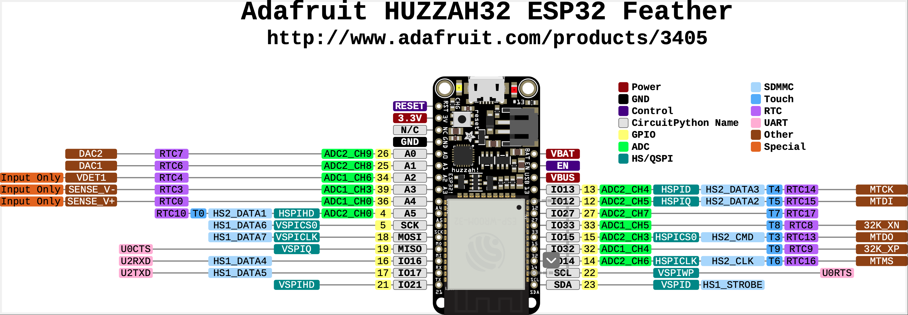
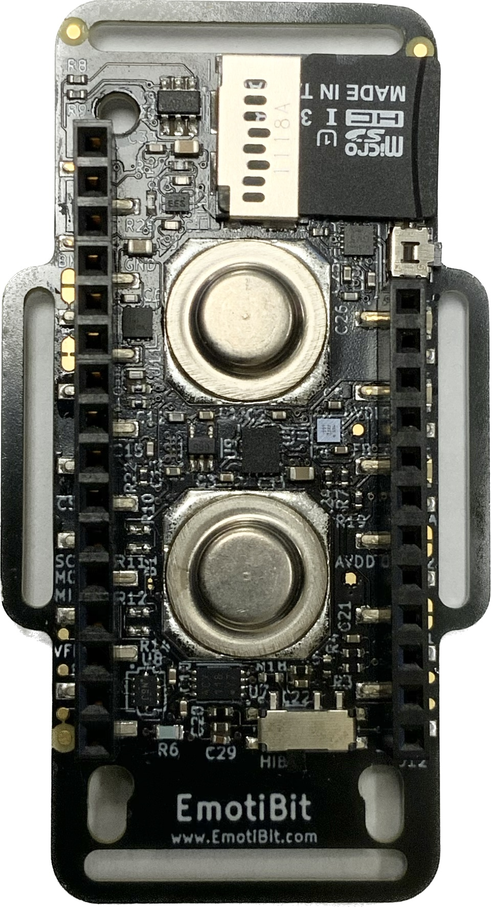

# aMDI Embedded Systems Project - Fall 2022
## Author: Renzo Garza Motta<br>

---
## Outline
- [Getting Started](#getting-started)
  - [Components](#components)
  - [EmotiBit Software](#emotibit-software)
---

## Getting Started
### Components
- Emotibit
- Adafruit Huzzah32 Microcontroller
- 400 mAh Li-Ion Battery
- SD Card

### EmotiBit Software Implementation
1. Download the Arduino IDE.
2. Within the Arduino IDE download via the Board Manager the "esp32 by Espressif Systems" to add support for the Adafruit Feather.
3. Ensure all library dependencies are installed. Refer to [Library Dependencies](#library-dependencies).
4. Implement custom code to the existing EmotiBit working firmware.
5. Verify code compiles for the target board "Adafruit ESP32 Feather" and select appropriate port.
6. If compiled successfully, uploade the code to the board.

**NOTE:** If the code *unchanged* does not compile, refer to Troubleshooting section.

## Adafruit Huzzah32 Pinout


Researching within the source code of the [board information page](https://github.com/espressif/arduino-esp32) under 

espressif/arduino-esp32/variants/feather_esp32/pins.arduino.h

by espressif on [Github](https://github.com/espressif) the pinout definitions for Arduino are listed below.

|Name|Pin Number|Notes|Name|Pin Number|Notes|
|---|---|---|---|---|---|
|TX/TX1|17|UART|A0|26|
|RX/RX1|16|UART|A1|25|
|SDA|23|I^2^C (Data)|A2|34|
|SCL|22|I^2^C (Clock)|A3|39|
|SS|33|SPI(Slave Select)|A4|36|
|MOSI|18|SPI (Master-Out Slave-In)|A5|4|
|MISO|19|SPI (Master-In Slave-Out)|A6|14|
|SCK|5|SPI (Clock)|A7|32|
|T0|4||A8|15|
|T3|15||A9|33|
|T4|13||A10|27|
|T5|12||A11|12|
|T6|14||A12|13|Battery Monitor (VBat)
|T7|27||A13/BATT_MONITOR|35|
|T8|33||DAC1|25|Digital-to-Analog Converter
|T9|32||DAC2|26|Digital-to-Analog Converter
|LED_BUILT|13|BUILTIN_LED/LED_BUILTIN|||

Additional Macros:
```c
EXTERNAL_NUM_INTERRUPTS 16  //Number of external interrupts available
NUM_DIGITAL_PINS        40  //Number of digital pins available
NUM_ANALOG_INPUTS       16  //Number of analog pins available
```

## EmotiBit Pinout
<!--  -->
<p align="center">
  
</p>

|Name|Pin Number|Notes|Name|Pin Number|Notes|
|---|---|---|---|---|---|
|EMOTIBIT_BUTTON|1||edlPin|A4|
|SPI_CLK|2||edrPin|A3|
|SPI_MOSI|3||||
|SPI_MISO|4||||
|PPG_INT|5||||
|BMI_INT1|6||||
|BMI_INT2|7||||
|BMM_INT|8||||
|BATTERY_READ_PIN|9||||
|EMOTIBIT_I2C_CLK_PIN|13|Confirmed|||
|EMOTIBIT_I2C_DAT_PIN|27|Confirmed|||
|HIBERNATE_PIN|32|Confirmed|||
|SD_CARD_CHIP_SEL_PIN|4|Confirmed|||
|DEBUG_OUT_PIN_0|||||
|DEBUG_OUT_PIN_1|||||
|DEBUG_OUT_PIN_2|||||
||||||

<!-- <details>
  <summary>Device Addresses</summary> -->
  |Device|Function|I^2^C|Secondary I^2^C 7-Bit Address| Additional Notes|
  |---|---|---|---|---|
  |MAX30101|High-Sensitivity Pulse Oximeter and Heart-Rate Sensor for Wearable Health|0x57|-|Datasheet page 5, Electrical Characteristic Table.|
  |BMI160|Accelerometer, Gyroscope, 6 Axis Sensor I^2^C SPI Output|0x68|0x69|Datasheet page 93, Primary I^2^C interface.|
  |MLX90632|Infrared Temperature Sensor|0x3A|0x3B|I^2^C address is programmable in EEPROM. Datasheet section 9.1.|
  |NCP5623B|LED Driver, Triple output, I^2^C Controlled|0x38|-|Datasheet page 8.|
  |34AA02|2Kb I^2^C compatible Serial Present Detect (SPD) Serial EEPROM |0x50|0x51/0x52/0x53|Normal Read/Write Datasheet section 3.6.|
  |||0x30|0x31/0x32/0x33|**Writing** to Write-Protected Registers|
  |ADS1113|16-Bit 860SPS 1-Ch Delta-Sigma ADC with Oscillator, Voltage Reference, and I^2^C|0x48|0x49/0x4A/0x4B|Datasheet Section 9.5.1.1 and 10.1.7.|
<!-- </details> -->

<!-- <details>
  <summary>Device Addresses</summary> -->

<!-- </details> -->

```c
//Defined in EmotiBitVersionController.h
  static const int _MAX_EMOTIBIT_PIN_COUNT = 28;
  int _assignedPin[_MAX_EMOTIBIT_PIN_COUNT] = { 0 }; 

  static const uint8_t SI7013_I2C_ADDR = 0x40;
  static const uint8_t EEPROM_I2C_ADDR = 0x50;  //#define EMOTIBIT_EEPROM_I2C_ADDRESS 0x50
  static const uint8_t MLX90632_I2C_ADDR = 0x3A;

  static const uint8_t EDL_DATA_START_ADDR = 0x82;
  static const uint8_t EDR_DATA_START_ADDR = 0xB0;
  static const uint8_t EMOTIBIT_VERSION_ADDR = 0xB7;
  static const uint8_t DATATYPE_VERSION_ADDR = 0xB6;

//Defined in EmotiBitVersionController.cpp
  _assignedPin[0] = ;                   //Index = 0
  _assignedPin[EMOTIBIT_BUTTON] = 12;   //Index = 1
  _assignedPin[SPI_CLK] = 5;            //Index = 2
  _assignedPin[SPI_MOSI] = 18;          //Index = 3
  _assignedPin[SPI_MISO] = 19;          //Index = 4
  _assignedPin[PPG_INT] = 25;           //Index = 5
  _assignedPin[BMI_INT1] = 14;          //Index = 6
  _assignedPin[BMI_INT2] = 33;          //Index = 7
  _assignedPin[BMM_INT] = 26;           //Index = 8
  _assignedPin[BATTERY_READ_PIN] = A13; //Index = 9
  _assignedPin[10] = UNKNOWN;           //Index = 10
  _assignedPin[11] = UNKNOWN;           //Index = 11
  _assignedPin[12] = UNKNOWN;           //Index = 12
  _assignedPin[13] = UNKNOWN;           //Index = 13
  _assignedPin[14] = UNKNOWN;           //Index = 14
  _assignedPin[15] = UNKNOWN;           //Index = 15
  _assignedPin[16] = UNKNOWN;           //Index = 16
  _assignedPin[17] = UNKNOWN;           //Index = 17
  _assignedPin[18] = UNKNOWN;           //Index = 18
  _assignedPin[19] = UNKNOWN;           //Index = 19
  _assignedPin[20] = UNKNOWN;           //Index = 20
  _assignedPin[21] = UNKNOWN;           //Index = 21
  _assignedPin[22] = UNKNOWN;           //Index = 22
  _assignedPin[23] = UNKNOWN;           //Index = 23
  _assignedPin[24] = UNKNOWN;           //Index = 24
  _assignedPin[25] = UNKNOWN;           //Index = 25
  _assignedPin[26] = UNKNOWN;           //Index = 26
  _assignedPin[27] = UNKNOWN;           //Index = 27
```


```c
//How to get device pin mapping within setup() function;
void setup(){
  Serial.begin(SERIAL_BAUD);
  Serial.println("Serial started");
  delay(2000);	// short delay to allow user to connect to serial, if desired

  emotibit.setup();

  // Attach callback functions
  emotibit.attachShortButtonPress(&onShortButtonPress);
  emotibit.attachLongButtonPress(&onLongButtonPress);

  EmotiBitVersionController emotiBitVersionController;
  emotiBitVersionController.echoPinMapping();
}
```
```c
//Serial Output from echoPinMapping();
Serial started
I2C data pin:27
I2C clk pin: 13
hibernate pin: 32
chip sel pin: 4
Firmware version: 1.4.1
vregEnablePinLogic: Active HIGH(V3+)
EmotiBit ready
Setting up I2C For ESP32...I2c setup complete
Setting clock to100000Initializing NVM controller: success
Successfully read variant info from NVM
[NVM VARIANT INFO] HW version: V04a
[NVM VARIANT INFO] SKU version: MD
[NVM VARIANT INFO] EmotiBit Number: 562
[NVM VARIANT INFO] EmotiBit device ID: MD-V4-0000562


EmotiBit HW version: V04a
Firmware version: 1.4.1

Sensor setup:

Set Samples averaged:
Initializing NCP5623....Completed
Initializing MAX30101....Completed
Initializing BMI160+BMM150.... DEVICE ID: D1 ... Completed
Initializing MLX90632... Success
Updated Register contents
EE_MEAS1: 840D
EE_MEAS2: 841D
Refresh Rate: 8
MODE_STEP
Initializing EDA... 
edaSeriesResistance: 0.00
samplingRate: 15.00
Configuring ADS ADC... 
enableDigitalFilter: 0
clipMin: -26500
clipMax: 26500
adcBits: 16
_ads.setDataRate: RATE_ADS1115_475SPS
_ads.setGain: GAIN_TWO
edaTransformSlope: 728.84
edaTransformIntercept: 14179797.00
Completed

Loading EDA calibration... 
0R, 	-19575.214844
10K, 	-19574.957031
100K, 	-19447.517578
1M, 	-18187.335938
10M, 	-5597.399902
edaTransformSlope = 713.75
edaTransformIntercept = 13981122.00
Completed
Sensor setup complete

Initializing SD card...0,card initialized.

Loading configuration file: /config.txt
WiFi network List Size: 1
Adding SSID: Renzo - YHWHYHWH

Setting up WiFi
Attempting to connect to SSID: Renzo
WiFi.begin() duration = 32
WiFi.status() = 6, total duration = 633
<<<<<<< Switching WiFi Networks >>>>>>>
E (37510) wifi:Association refused temporarily, comeback time 200 mSec
E (37717) wifi:Association refused temporarily, comeback time 200 mSec
E (37946) wifi:Association refused temporarily, comeback time 200 mSec
E (38152) wifi:Association refused temporarily, comeback time 200 mSec
E (38359) wifi:Association refused temporarily, comeback time 200 mSec
E (38565) wifi:Association refused temporarily, comeback time 200 mSec
E (38832) wifi:Association refused temporarily, comeback time 200 mSec
Attempting to connect to SSID: Renzo
WiFi.begin() duration = 28
E (38981) wifi:sta is connecting, return error
WiFi.status() = 6, total duration = 628
<<<<<<< Switching WiFi Networks >>>>>>>
Attempting to connect to SSID: Renzo
WiFi.begin() duration = 24
WiFi.status() = 3, total duration = 625
WiFi.begin() attempts = 2
Connected to WiFi
SSID: Renzo
IP Address: 172.20.10.14
signal strength (RSSI):-15 dBm
Starting EmotiBit advertising connection on port 3131
WiFi setup Completed
PowerMode::NORMAL_POWER
EmotiBit Setup complete

The data acquisition is executing on core: 1
Switch to EmotiBit Oscilloscope to stream Data
The main loop is executing on core: 1
EMOTIBIT_I2C_CLOCK: 13
EMOTIBTI_I2C_DATA: 27
HIBERNATE: 32
EMOTIBIT_BUTTON: 0
SD_CARD_CHIP_SELECT: 4
SPI_CLK: 0
SPI_MOSI: 0
SPI_MISO: 0
PPG_INT: 0
BMI_INT1: 0
BMI_INT2: 0
BMM_INT: 0
BATTERY_READ_PIN: 0
```

### Peripheral Addresses

### Wi-Fi Credentials Set-up

### Connecting to iPhone
### Connection to Network
**_EmotiBit cannot connect to enterprise networks due to hardware_**

## Tested Versions
    - Arduino IDE 2.0.1
    - EmotiBit v4 (Huzzah32)
    - ...

## Troubleshooting
* ### Not Connecting to Wi-Fi
* ### Unsuccessful Compilation
* ### Library Dependencies
  - EmotiBit
    - EmotiBit BMI160
    - EmotiBit MAX30101
    - EmotiBit MLS90632
    - EmotiBit NCP5623
    - EmotiBit SI7013
    - EmotiBit XPlat Utils
    - EmotiBit ADS1X15
    - EmotiBit External EEPROM

